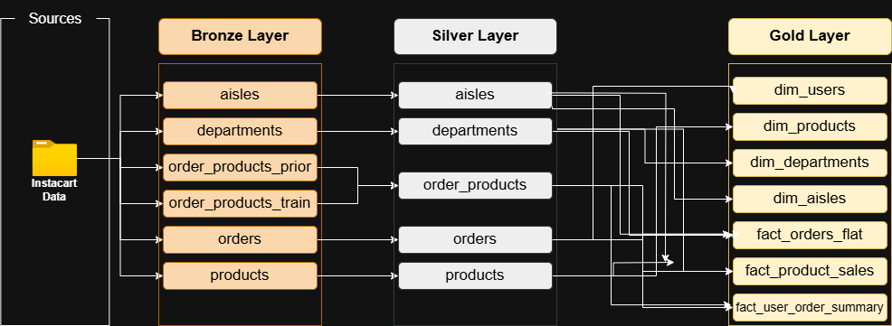
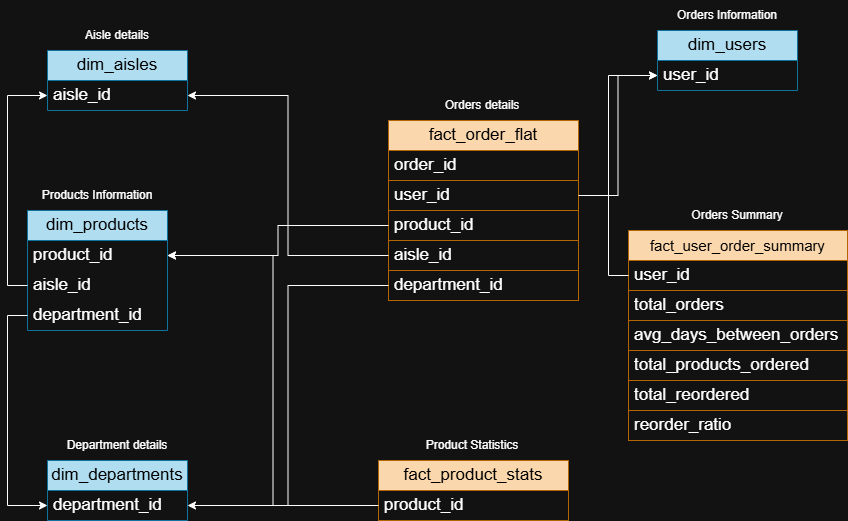
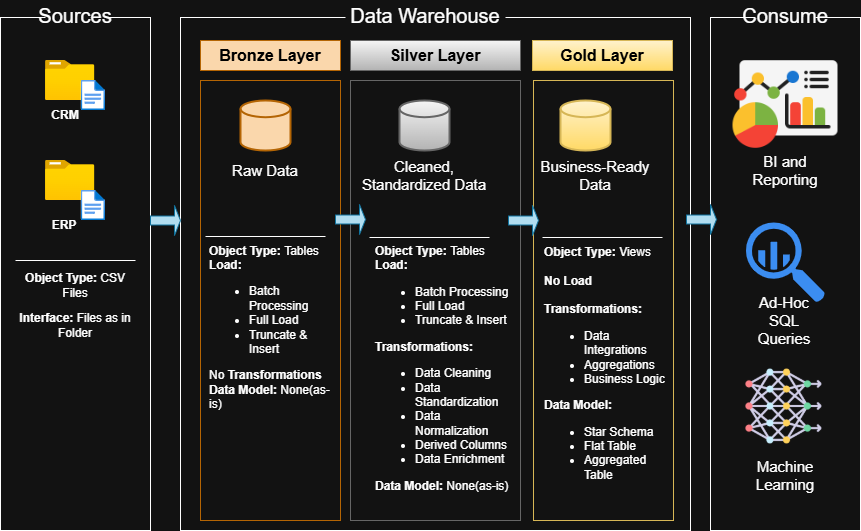

#  Instacart-DataWarehouse-PowerBI

This project combines a modern **data warehouse architecture** with **interactive Power BI dashboards** to analyze e-commerce operations using Instacart order data.

---

### Layers Implemented:
- **Bronze Layer:** Raw ingestion from CSVs
- **Silver Layer:** Cleaned and joined datasets
- **Gold Layer:** Constellation/Galaxy  schema models
- **Visualization:** Power BI dashboards

---

##  Data Lineage

Illustrates end-to-end flow from raw data to dashboards.

---

##  Silver Layer – Data Integration

In this layer, raw datasets are joined and cleaned to prepare for modeling.

.drawio.png)

---

##  Gold Layer – Snowflake Schema

Dimensional modeling is implemented in the **Gold Layer** using a snowflake schema.

###  Dimensions
- `dim_users`
- `dim_orders`
- `dim_products`
- `dim_aisles`
- `dim_departments`

###  Fact Tables
- `fact_order_flat`
- `fact_user_order_summary`
- `fact_product_stats`

---

##  Architecture Diagram

An architectural view of all components: storage, processing, modeling, and reporting.

---

##  Power BI Dashboards (Coming Soon)

**Planned Visualizations:**
-  **Product Analytics:** Most reordered items, aisle/dept trends  
-  **User Behavior:** Avg. days between orders, reorder ratio  
-  **Order Trends:** Order frequency, hour/day distribution  
-  **Filters and Drill-downs:** By department, user segment, etc.

> Dashboards will be embedded here once complete. Stay tuned!

---

##  Future Enhancements

- Connect live to cloud warehouse for real-time reporting  
- Add CI/CD for model deployment  
- Enable Power BI auto-refresh  
- Add DAX measures for deeper insights

---

##  Author

**Sanjana Marri**  
Master’s Student in Computer Science | Passionate about data engineering, BI, and analytics

---

## License

This project is licensed under the MIT License. See the [LICENSE](LICENSE) file for details.

---

